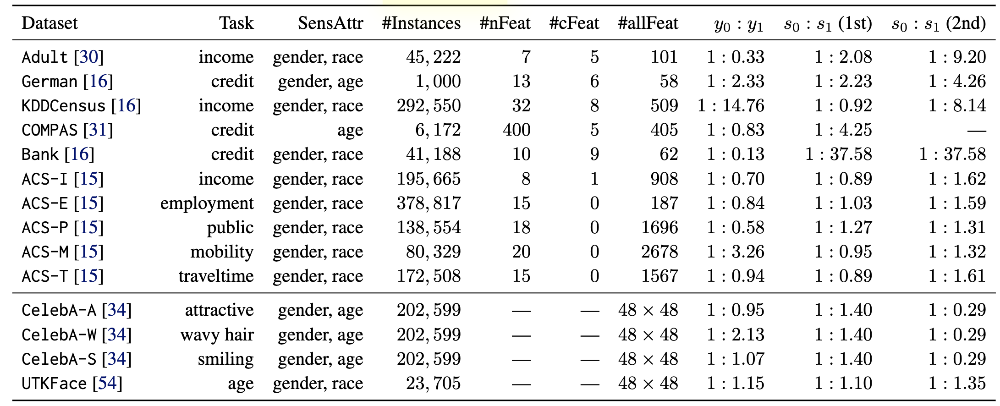
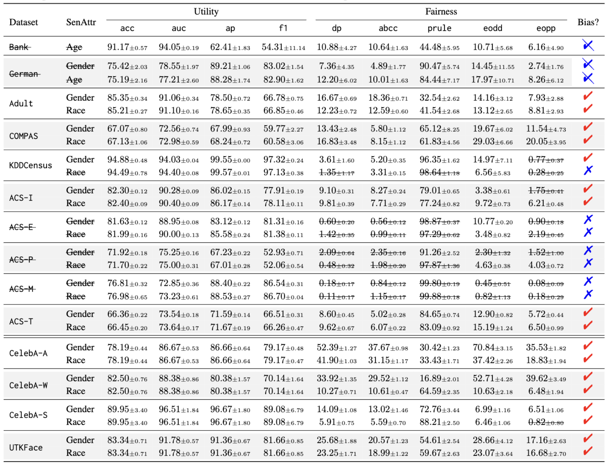
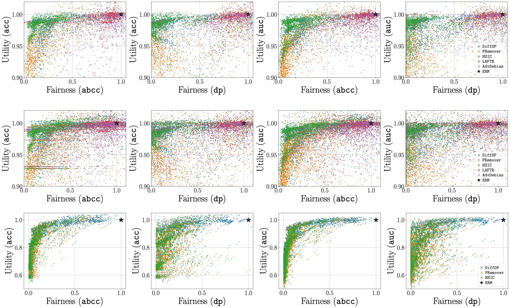

<p align="center">

</p>
<br><br>

## Update:
- [08/01/2023]: design a logo for FFB!
- [07/12/2023]: update the datasets and downloading instructions!


## 1. Overview 
The Fair Fairness Benchmark is a PyTorch-based framework for evaluating the fairness of machine learning models. The framework is designed to be simple and customizable, making it accessible to researchers with varying levels of expertise. The benchmark includes a set of predefined fairness metrics and algorithms, but users can easily modify or add new metrics and algorithms to suit their specific research questions. For more information, please refer to our paper [FFB: A Fair Fairness Benchmark for In-Processing Group Fairness Methods](https://arxiv.org/abs/2306.09468).


## 2. Our Goals

This benchmark aims to be

* **minimalistic**
* **hackable**
* **beginner-friendly**
* **torch-idiomatic**
* **reference implementation for researchers**
* ......


## 3. Fair Fairness Benchmark(FFB)
### 3.1 Datasets

Please refer to the [datasets/readme.md](./datasets/readme.md) for datasets downloading instructions.


- **UCI Adult**: U.S. census data predicting an individual's income over $50K using demographic and financial details.
- **COMPAS**: Criminal defendants' records used to predict recidivism within two years.
- **German Credit**: Information about credit applicants at a German bank used for credit risk rating prediction.
- **Bank Marketing**: Data from a Portuguese bank used to predict client subscription to term deposit.
- **ACS**: From the American Community Survey, used for multiple prediction tasks such as income and employment.
- **KDD Census**: Like UCI Adult but with more instances, used to predict if an individual’s income is over $50K.
- **CelebFaces Attributes**: 20k celebrity face images annotated with 40 binary labels of specific facial attributes.
- **UTKFace**: Over 20k face images from diverse ethnicities and ages, annotated with age, gender, and ethnicity.


The statistics of the datasets are as the following:

<p align="center">



### 3.2 In-Processing Group Fairness Methods
- **ERM**: Standard machine learning method that minimizes the empirical risk of the training data. Serves as a common baseline for fairness methods.
- **DiffDP, DiffEopp, DiffEodd**: Gap regularization methods for demographic parity, equalized opportunity, and equalized odds. These fairness definitions cannot be optimized directly, but gap regularization is differentiable and can be optimized using gradient descent.
- **PRemover**: Aims to minimize the mutual information between the prediction accuracy and the sensitive attributes.
- **HSIC**: Minimizes the Hilbert-Schmidt Independence Criterion between the prediction accuracy and the sensitive attributes.
- **AdvDebias**: Learns a classifier that maximizes the prediction ability and simultaneously minimizes an adversary's ability to predict the sensitive attributes from the predictions.
- **LAFTR**: A fair representation learning method aiming to learn an intermediate representation that minimizes the classification loss, reconstruction error, and the adversary's ability to predict the sensitive attributes from the representation.


### 3.4 Our Results

**1. Not all widely used fairness datasets stably exhibit fairness issues.** We found that in some cases, the bias in these datasets is either not consistently present or its manifestation varies significantly. This finding indicates that relying on these datasets for fairness analysis might not always provide stable or reliable results.
<p align="center">


**2.The utility-fairness performance of the current fairness method exhibits trade-offs.** We conduct experiments using various in-processing fairness methods and analyze the ability to adjust the trade-offs to cater to specific needs while maintaining a balance between accuracy and fairness.
<p align="center">


## 4. How to Run

### 4.1 Setup
To install the Fair Fairness Benchmark, simply clone this repository and install the required dependencies by running the following command:

```
pip install -r requirements.txt
```
### 4.2 Run Example
```
python -u ./ffb_tabular_erm.py --dataset acs --model erm --sensitive_attr age --target_attr income --batch_size 32 --seed 89793 --log_freq 1 --num_training_steps 150
python -u ./ffb_tabular_diffdp.py --dataset acs --model diffdp --sensitive_attr race --target_attr income --batch_size 4096 --lam 1.4 --seed 89793 --log_freq 1 --num_training_steps 150
wait;
```

## 5. Contributing
We welcome contributions from the research community to improve and extend the Fair Fairness Benchmark. If you have an idea for a new metric or algorithm, or would like to report a bug, please open an issue or submit a pull request.


## 6. License
The Fair Fairness Benchmark is released under the MIT License.

---
If you find our resources useful, please kindly cite our paper.

```bibtex
@misc{han2023ffb,
      title={FFB: A Fair Fairness Benchmark for In-Processing Group Fairness Methods}, 
      author={Xiaotian Han and Jianfeng Chi and Yu Chen and Qifan Wang and Han Zhao and Na Zou and Xia Hu},
      year={2023},
      eprint={2306.09468},
      archivePrefix={arXiv},
      primaryClass={cs.LG}
}
```